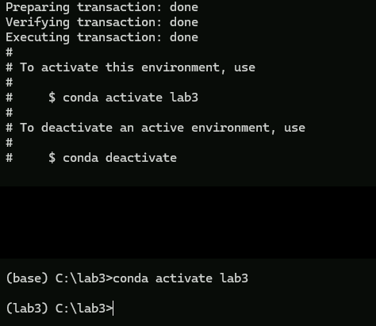
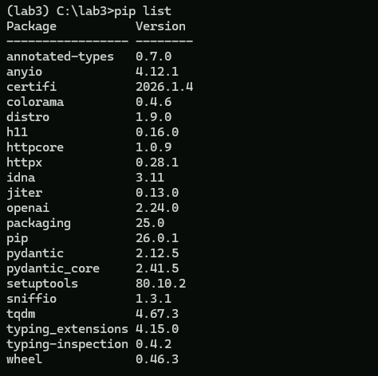

# Lab 3 - Prompt Engineering

In this lab you will experiment with temperature, top-p and maximum output settings to control the output generated by OpenAI

Note that you can't change these settings in the interactive mode, but you can change them in the API calls

## Conda Setup

Open a conda terminal from the icon on the taskbar.

Create a directory to store your work in, in this case, we are using c:\lab3.

Create a new conda environment where you will install the OpenAI API and then activate the environment. In these examples, we are calling it `lab3`

```bash
conda create --name lab3
conda activate lab3
```




Once you have activated the environment, install `pip` and the `openai` API

```bash
conda install pip
pip install openai
```

Once you have done this, confirm that `openai` is installed

```bash
pip list
```


## Using the AI Key

You need to supply an API key to use OpenAI. This key cannot be included in the repository since the security scans for GitHub won't allow it.

Instead, you can find it at the url `https://exgnosis.org/oai.txt`  Open this url in a browser _in the VM_ otherwise you won't be able to copy and paste it.

Copy the key to the clipboard. 

This key will be invalidated at the end of today's class.


In the conda shell, set the environment variable `OPENAI_API_KEY` to this value as shown. If you open a different shell, you will have to recreate this environment variable in the new shell. Print out the value to be sure you set it correctly.

```bash
set OPENAI_API_KEY=sk.....
echo %OPENAI_API_KEY%
```


